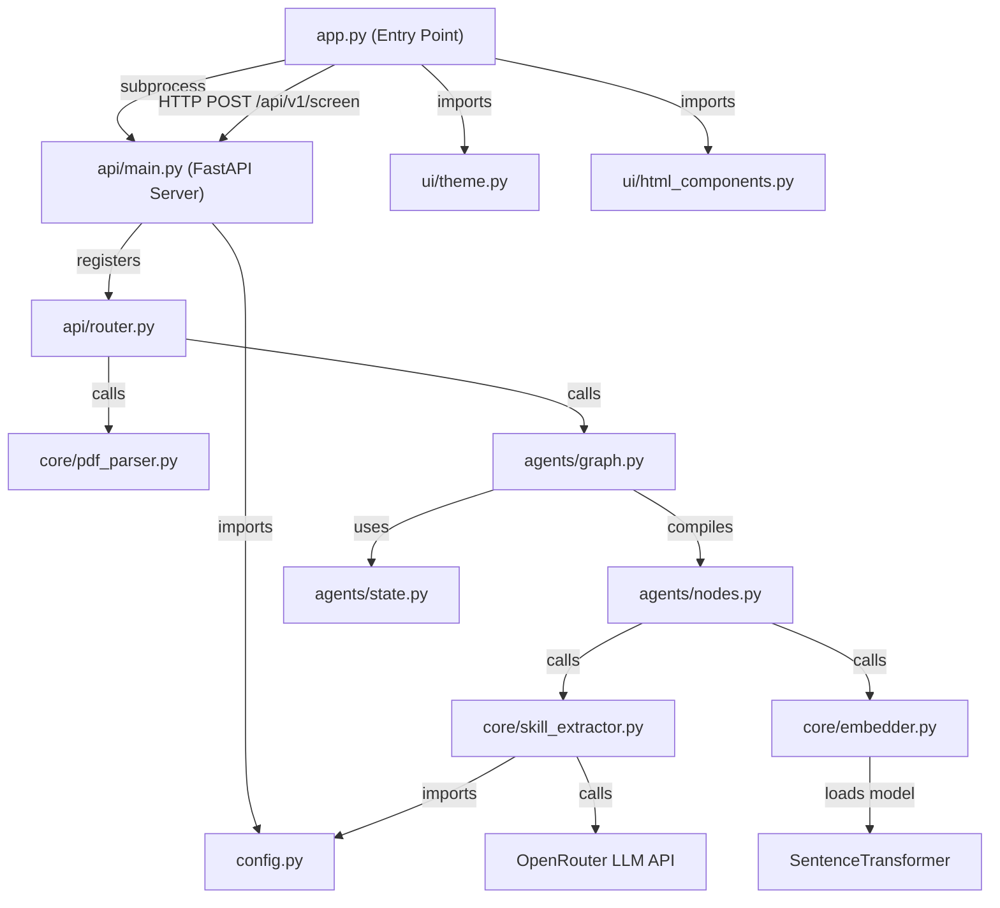
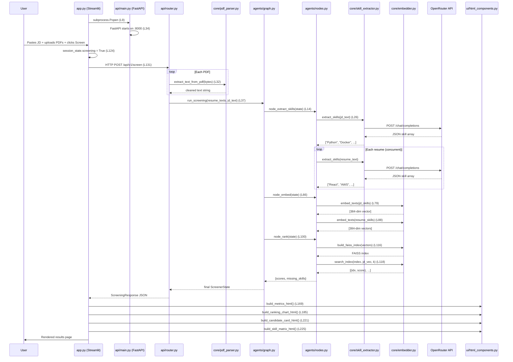

# ResumeIQ — Application Workflow

> Complete execution flow tracing how the application starts, how data travels between files, and what each key line does.

---

## High-Level Architecture



---

## File Map

| File | Purpose |
|------|---------|
| `app.py` | Entry point — launches backend subprocess, runs Streamlit UI |
| `config.py` | Loads `.env`, exposes singleton `settings` object |
| `api/main.py` | Creates FastAPI app, adds CORS, mounts router |
| `api/router.py` | POST `/screen` endpoint — orchestrates the full pipeline |
| `api/schemas.py` | Pydantic response models (`RankingResult`, `ScreeningResponse`) |
| `agents/graph.py` | Builds and compiles the LangGraph pipeline |
| `agents/state.py` | `ScreenerState` TypedDict shared across all nodes |
| `agents/nodes.py` | Three node functions: extract → embed → rank |
| `core/pdf_parser.py` | Extracts text from PDF bytes via PyMuPDF |
| `core/skill_extractor.py` | Calls OpenRouter LLM to extract skills as JSON |
| `core/embedder.py` | Local embeddings (SentenceTransformers) + FAISS index |
| `ui/theme.py` | Injects full CSS theme into Streamlit |
| `ui/html_components.py` | Builds metrics, cards, charts, matrix as raw HTML |
| `ui/components.py` | Plotly/Pandas-based UI helpers (legacy, not used by `app.py`) |
| `observability/langsmith_setup.py` | Configures LangSmith tracing env vars |
| `observability/logger.py` | Structured logging via structlog |

---

## Phase 1 — Application Startup

### Step 1: `app.py` boots (Lines 1–17)

```
app.py:7   → Checks env var `_BACKEND_STARTED`
app.py:8   → If not set, enters the subprocess block
app.py:9   → subprocess.Popen runs `python -m api.main` (launches FastAPI server)
app.py:14  → Sets `_BACKEND_STARTED=1` to prevent duplicate spawns on Streamlit reruns
app.py:15  → Sleeps 3 seconds to let the backend start
app.py:17  → Adds `ui/` to sys.path so theme and html_components can be imported
```

**Travels to → `api/main.py`** (as a separate process)

### Step 2: `api/main.py` starts the FastAPI server (Lines 1–34)

```
api/main.py:7   → Imports `router` from api/router.py
api/main.py:8   → Imports `settings` from config.py
```

**Travels to → `config.py`**

### Step 3: `config.py` loads settings (Lines 1–18)

```
config.py:5   → load_dotenv() reads the .env file into os.environ
config.py:7   → Defines Settings class with fields:
                  OPENROUTER_API_KEY, OPENROUTER_BASE_URL, LLM_MODEL,
                  EMBEDDING_MODEL, LANGSMITH_API_KEY, LANGSMITH_PROJECT, LOG_LEVEL
config.py:18  → Instantiates `settings = Settings()` (singleton used everywhere)
```

**Returns to → `api/main.py`**

### Step 4: `api/main.py` finishes setup (Lines 10–34)

```
api/main.py:10  → Configures root logging level from settings.LOG_LEVEL
api/main.py:13  → Creates FastAPI app instance: FastAPI(title="Resume Screener API")
api/main.py:15  → Adds CORSMiddleware allowing all origins (dev mode)
api/main.py:23  → Registers startup event that logs "Resume Screener API started"
api/main.py:27  → Mounts the router at prefix /api/v1
api/main.py:29  → Registers GET /health endpoint
api/main.py:33  → If run directly: starts uvicorn on 0.0.0.0:8000
```

### Step 5: Back in `app.py` — Streamlit UI initializes (Lines 19–45)

```
app.py:19  → import streamlit
app.py:21  → from theme import apply_theme
app.py:22  → from html_components import build_candidate_card_html, etc.
app.py:30  → API_URL defaults to http://localhost:8000
app.py:32  → st.set_page_config(page_title="ResumeIQ", layout="wide")
app.py:39  → Initializes session_state: results, jd_skills, screening, proc_time
app.py:44  → dark = False
app.py:45  → apply_theme(dark)
```

**Travels to → `ui/theme.py`**

### Step 6: `ui/theme.py` injects CSS (Lines 3–313)

```
theme.py:3    → def apply_theme(dark: bool)
theme.py:4    → Builds a massive CSS string with :root variables, typography,
                sidebar styles, file uploader overrides, button styles, tabs, etc.
theme.py:313  → st.markdown(css, unsafe_allow_html=True) injects it into the page
```

**Returns to → `app.py`**

---

## Phase 2 — Sidebar Rendering

### Step 7: `app.py` renders the sidebar (Lines 47–118)

```
app.py:47   → with st.sidebar: opens sidebar context
app.py:48   → Renders ResumeIQ logo/branding as HTML
app.py:60   → Renders "Job description" label
app.py:61   → jd_text = st.text_area(...) — user pastes the JD here
app.py:71   → Renders "Resumes (PDF · max 5)" label
app.py:72   → uploaded_files = st.file_uploader(...) — user uploads PDFs
app.py:80   → Shows file count badge (green ≤5, red >5)
app.py:93   → If screening is active, shows animated dot spinner
app.py:109  → can_run = checks JD not empty AND files uploaded AND ≤5 files
app.py:110  → screen_btn = st.button("Screen Candidates") — primary action button
```

---

## Phase 3 — Screening Trigger (User Clicks Button)

### Step 8: `app.py` handles button click (Lines 120–147)

```
app.py:120  → if screen_btn: checks if button was clicked
app.py:121  →   Validates ≤5 files, shows error if exceeded
app.py:124  →   Sets session_state["screening"] = True
app.py:125  →   st.rerun() — triggers page reload to show spinner
```

On the rerun:

```
app.py:127  → if screening is True AND files AND jd_text exist:
app.py:129  →   Prepares multipart files: [(name, bytes, mime_type)]
app.py:130  →   Opens httpx.Client with 120s timeout
app.py:131  →   POST request to {API_URL}/api/v1/screen
                  with files=resumes, data={"jd_text": ...}
```

**Travels to → `api/router.py` (via HTTP)**

---

## Phase 4 — Backend Pipeline

### Step 9: `api/router.py` — POST `/screen` handler (Lines 13–93)

```
router.py:18  → start_time = time.perf_counter() — starts the timer
router.py:22  → Validates resume count is between 1 and 5
router.py:26  → Loops through each uploaded resume:
router.py:27  →   Checks content_type is "application/pdf"
router.py:30  →   file_bytes = await resume.read()
router.py:32  →   text = extract_text_from_pdf(file_bytes)
```

**Travels to → `core/pdf_parser.py`**

### Step 10: `core/pdf_parser.py` — PDF text extraction (Lines 3–22)

```
pdf_parser.py:8   → doc = fitz.open(stream=file_bytes, filetype="pdf")
pdf_parser.py:11  → Loops through each page, appends page.get_text()
pdf_parser.py:14  → doc.close()
pdf_parser.py:16  → raw_text = "".join(text_chunks)
pdf_parser.py:17  → clean_text = " ".join(raw_text.split()) — strips whitespace
pdf_parser.py:19  → If clean_text < 50 chars → raises ValueError
pdf_parser.py:22  → Returns clean_text
```

**Returns to → `api/router.py`**

### Step 11: `api/router.py` invokes the LangGraph pipeline (Line 37)

```
router.py:33  → resume_texts[resume.filename] = text (stores parsed text per file)
router.py:37  → state = run_screening(resume_texts, jd_text)
```

**Travels to → `agents/graph.py`**

### Step 12: `agents/graph.py` — Pipeline definition and execution (Lines 1–33)

```
graph.py:6   → graph = StateGraph(ScreenerState) — creates graph with state schema
graph.py:8   → Adds node "extract_skills" → node_extract_skills function
graph.py:9   → Adds node "embed"          → node_embed function
graph.py:10  → Adds node "rank"           → node_rank function
graph.py:12  → Entry point = "extract_skills"
graph.py:14  → Edge: extract_skills → embed
graph.py:15  → Edge: embed → rank
graph.py:17  → Finish point = "rank"
graph.py:19  → app = graph.compile() — compiles the DAG

graph.py:27  → state = default_state() — gets empty ScreenerState
graph.py:28  → state["resume_texts"] = resume_texts
graph.py:29  → state["jd_text"] = jd_text
graph.py:31  → result = app.invoke(state) — EXECUTES THE FULL PIPELINE
```

**Travels to → `agents/state.py`** for `default_state()`

### Step 13: `agents/state.py` — State schema (Lines 3–26)

```
state.py:3   → ScreenerState TypedDict with fields:
                resume_texts, jd_text, extracted_skills, jd_skills,
                embeddings, jd_embedding, scores, missing_skills, error
state.py:16  → default_state() returns all fields initialized to empty values
```

**Returns to → `agents/graph.py`, then pipeline starts executing nodes**

---

## Phase 5 — Node 1: Skill Extraction

### Step 14: `agents/nodes.py` — `node_extract_skills` (Lines 14–64)

```
nodes.py:16  → Checks for existing error in state, returns {} if found
nodes.py:19  → Gets resume_texts and jd_text from state
nodes.py:25  → If jd_text exists: calls extract_skills(jd_text) for JD skills
```

**Travels to → `core/skill_extractor.py`**

### Step 15: `core/skill_extractor.py` — LLM skill extraction (Lines 10–84)

```
skill_extractor.py:11  → Builds URL: {OPENROUTER_BASE_URL}/chat/completions
skill_extractor.py:12  → Sets headers with Authorization Bearer token
skill_extractor.py:19  → Builds payload with system prompt:
                           "Extract hard skills, tools, frameworks. Return JSON array only."
skill_extractor.py:32  → _make_request() sends POST with 30s timeout
skill_extractor.py:37  → If HTTP 429 (rate limit): waits 60s, retries once
skill_extractor.py:61  → Parses response JSON
skill_extractor.py:64  → Strips markdown backticks if present
skill_extractor.py:74  → json.loads(content) → returns list of skill strings
```

**Returns to → `agents/nodes.py`**

### Step 16: Taxonomy fallback (Lines 28–47)

```
nodes.py:28  → If LLM returned 0 JD skills:
nodes.py:30  →   Opens skills/global_skills.yaml
nodes.py:33  →   Gets list of job role names from taxonomy
nodes.py:35  →   Embeds all role names via embed_texts(roles)
nodes.py:36  →   Embeds the JD text
nodes.py:38  →   Builds FAISS index of role embeddings
nodes.py:39  →   Searches for closest matching role
nodes.py:43  →   Uses that role's skills as fallback jd_skills
```

**Travels to → `core/embedder.py`** for embedding

### Step 17: Resume skill extraction (Lines 49–57)

```
nodes.py:49  → ThreadPoolExecutor(max_workers=5) — concurrent extraction
nodes.py:50  → Submits extract_skills(text) for each resume in parallel
nodes.py:54  → Collects results: extracted_skills[filename] = [skills...]
nodes.py:59  → Returns {"extracted_skills": {...}, "jd_skills": [...]}
```

**State updates, pipeline moves to next node →**

---

## Phase 6 — Node 2: Embedding

### Step 18: `agents/nodes.py` — `node_embed` (Lines 66–98)

```
nodes.py:71  → Gets extracted_skills and jd_skills from state
nodes.py:77  → Joins JD skills into comma-separated string
nodes.py:79  → jd_embedding = embed_texts([jd_skills_str])[0]
```

**Travels to → `core/embedder.py`**

### Step 19: `core/embedder.py` — Local embedding engine (Lines 5–52)

```
embedder.py:5   → _model = SentenceTransformer("all-MiniLM-L6-v2") — loaded once at import
embedder.py:14  → _model.encode(texts, normalize_embeddings=True)
embedder.py:15  → Returns embeddings as list[list[float]]
```

**Returns to → `agents/nodes.py`**

```
nodes.py:83  → time.sleep(2) — rate limit buffer
nodes.py:87  → Joins each resume's skills into comma-separated strings
nodes.py:88  → resume_embeddings = embed_texts(resume_skill_strings) — batch embed
nodes.py:90  → Maps each resume name to its embedding vector
nodes.py:93  → Returns {"embeddings": {...}, "jd_embedding": [...]}
```

**State updates, pipeline moves to next node →**

---

## Phase 7 — Node 3: Ranking

### Step 20: `agents/nodes.py` — `node_rank` (Lines 100–137)

```
nodes.py:105 → Gets embeddings, jd_embedding, jd_skills, extracted_skills from state
nodes.py:116 → index = build_faiss_index(resume_embs_list)
```

**Travels to → `core/embedder.py`**

```
embedder.py:25  → vectors = np.array(embeddings, dtype=np.float32)
embedder.py:28  → index = faiss.IndexFlatIP(384) — Inner Product index
embedder.py:29  → index.add(vectors)
```

**Returns to → `agents/nodes.py`**

```
nodes.py:118 → results = search_index(index, jd_embedding, k)
```

**Travels to → `core/embedder.py`**

```
embedder.py:41  → query_vector reshaped to (1, 384)
embedder.py:43  → scores, indices = index.search(query_vector, k)
embedder.py:46  → Builds (idx, score) tuples, sorted descending
```

**Returns to → `agents/nodes.py`**

```
nodes.py:120 → Maps index positions back to filenames with scores
nodes.py:126 → Computes missing_skills = set(jd_skills) - set(resume_skills)
nodes.py:132 → Returns {"scores": {...}, "missing_skills": {...}}
```

**Pipeline complete → returns full state to `agents/graph.py` → returns to `api/router.py`**

---

## Phase 8 — Response Assembly

### Step 21: `api/router.py` builds the response (Lines 39–87)

```
router.py:39  → Checks state["error"], raises 422 if present
router.py:42  → Extracts: extracted_skills, jd_skills, scores, missing_skills
router.py:54  → matched_skills = jd_skills_set ∩ resume_skills (set intersection)
router.py:56  → missing_skills from state or computed as set difference
router.py:65  → Sorts raw_results by score descending
router.py:68  → Creates RankingResult Pydantic objects with rank assigned
```

**Travels to → `api/schemas.py`**

```
schemas.py:3  → RankingResult: candidate_name, score (0–1), matched_skills,
                missing_skills, rank (1 = best)
schemas.py:10 → ScreeningResponse: results[], jd_skills[], total_candidates, time
```

**Returns to → `api/router.py`**

```
router.py:79  → processing_time = perf_counter() - start_time
router.py:82  → Returns ScreeningResponse with all results + timing
```

**HTTP response travels back to → `app.py`**

---

## Phase 9 — Results Display

### Step 22: `app.py` receives and stores results (Lines 136–147)

```
app.py:136  → if response.status_code == 200:
app.py:137  →   data = response.json()
app.py:138  →   session_state["results"] = data["results"]
app.py:139  →   session_state["jd_skills"] = data["jd_skills"]
app.py:140  →   session_state["proc_time"] = data["processing_time_seconds"]
app.py:146  → session_state["screening"] = False
app.py:147  → st.rerun() — final rerun to display results
```

### Step 23: `app.py` renders results (Lines 149–263)

```
app.py:149  → c = get_colors(dark) — gets theme color palette
```

**Travels to → `ui/html_components.py`**

```
html_components.py:1  → get_colors(dark) returns dict of 20+ color tokens
```

**Returns to → `app.py`**

```
app.py:151  → if session_state.results is not None:
app.py:155  →   Sorts results by score descending
app.py:159  →   Creates CandidateObj wrappers (dict → object with attributes)
app.py:165  →   Renders "Screening Results · N candidates" header
app.py:169  →   metrics_html = build_metrics_html(res_objs, jd_skills, dark)
app.py:170  →   st.html(metrics_html) — renders 4 KPI metric cards
app.py:172  →   Computes universal_gaps (skills missing from ALL candidates)
app.py:179  →   Creates 3 tabs: Overview, Candidate cards, Skill matrix
```

### Tab 1 — Overview (Lines 181–217)

```
app.py:185  → chart_html = build_ranking_chart_html(res_objs, dark)
              → html_components.py:213 builds horizontal bar chart as pure HTML
app.py:192  → Builds skill coverage heatmap showing count/total per skill
```

### Tab 2 — Candidate Cards (Lines 219–222)

```
app.py:221  → build_candidate_card_html(r_obj, rank, jd_skills, dark)
              → html_components.py:115 builds card with avatar, score badge,
                skill fit progress bar, matched/missing skill pills, verdict
```

### Tab 3 — Skill Matrix + CSV Export (Lines 224–247)

```
app.py:225  → build_skill_matrix_html(res_objs, jd_skills, dark)
              → html_components.py:284 builds HTML table: skills × candidates
app.py:229  → Builds CSV string: Rank, Name, Score%, Matched, Missing, Verdict
app.py:242  → st.download_button for CSV export
```

### Empty State (Lines 249–263)

```
app.py:249  → else: (no results yet)
app.py:250  →   Renders SVG icon + "Ready to screen" message
```

---

## Complete Execution Flow (Summary)



---

## Key Data Transformations

| Stage | Input | Output | Where |
|-------|-------|--------|-------|
| PDF Parse | raw bytes | cleaned text string | `pdf_parser.py:8–22` |
| Skill Extract | text string | `["Python", "AWS", ...]` | `skill_extractor.py:10–84` |
| Embed | comma-joined skills | 384-dim float vector | `embedder.py:7–15` |
| Index Build | list of vectors | FAISS IndexFlatIP | `embedder.py:17–31` |
| Search | query vector + index | `[(idx, score), ...]` | `embedder.py:33–52` |
| Rank | search results | `{filename: score}` | `nodes.py:120–123` |
| Missing Skills | JD skills − resume skills | `{filename: [gaps]}` | `nodes.py:125–130` |
| Response | state dict | `ScreeningResponse` JSON | `router.py:67–87` |
